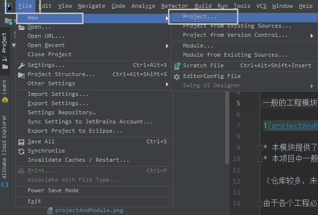
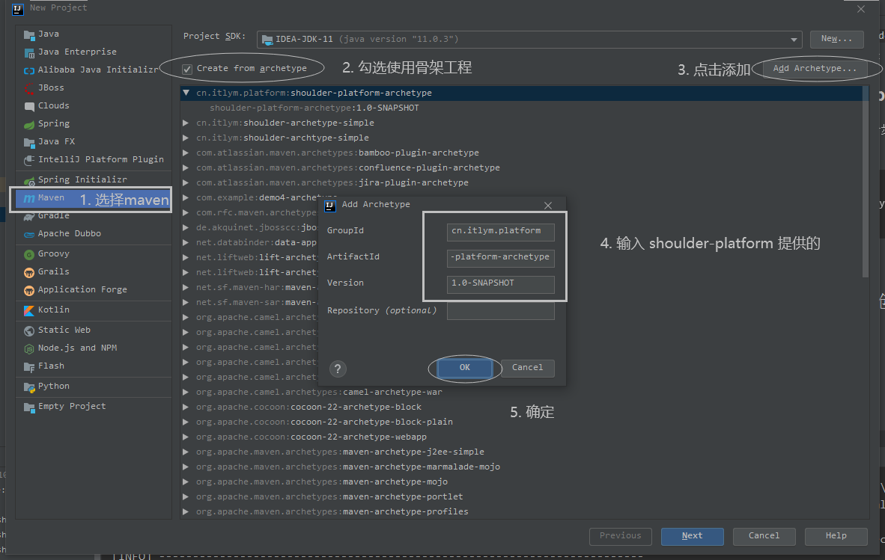
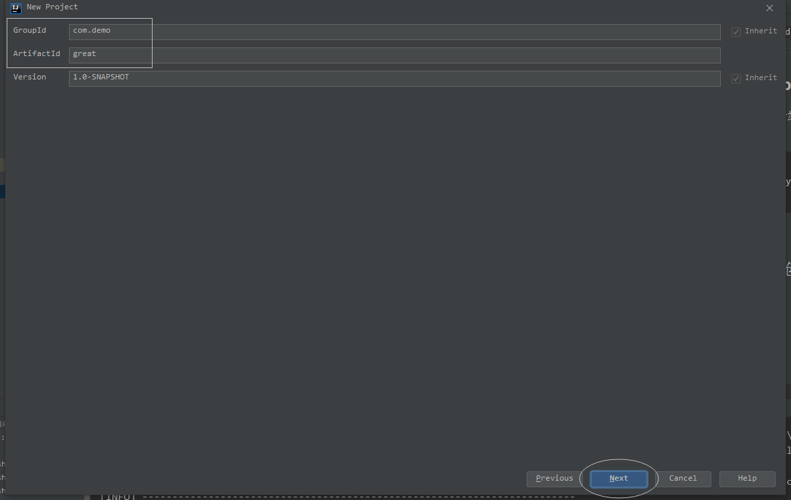
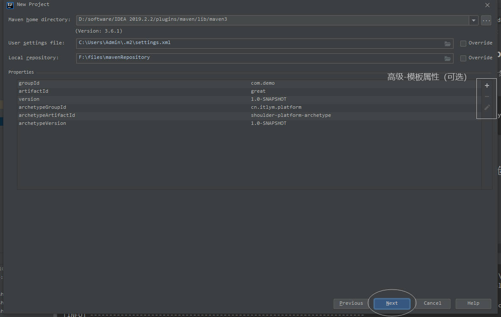
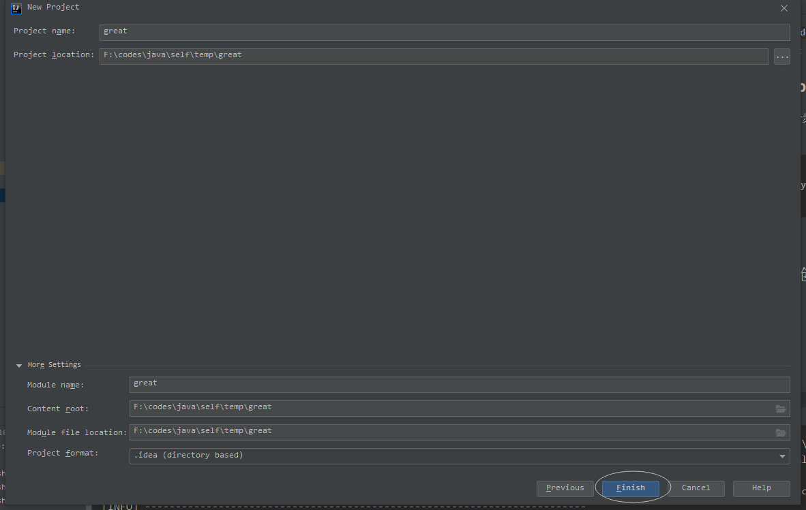
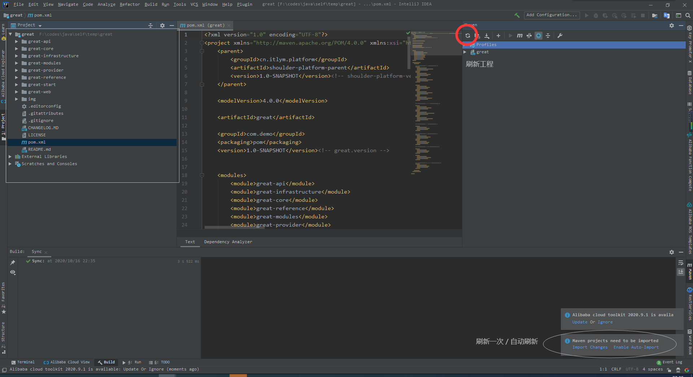

# [shoulder-platform-archetype](https://github.com/ChinaLym/Shoulder-Platform/tree/main/shoulder-platform-common/shoulder-platform-archetype)

基于 `shoulder-platform` 的多模块的 `maven` 骨架工程，适合基于 spring cloud 的微服务模式的微服务工程。

单模块教程：[shoulder-archetype-simple](https://github.com/ChinaLym/Shoulder-Framework/tree/master/shoulder-archetype-simple)

## 诞生背景

项目中大都是分模块开发，一个模块一个工程，通过一个外层工程管理所有模块，`Shoulder` 充分汲取 `领域驱动开发（DDD）` 概念的优点，合理利用 `maven` 的`聚合`、`继承`的特性来减少项目管理的成本。

> 聚合是为了管理多模块build，继承是方便依赖管理

目标是选择 `shoulder-platform-archetype` 便自动创建一个父模块，以及多个子模块，父模块既是聚合也可提供依赖继承。


## 保姆级使用介绍

下面以 IDEA 为例，介绍如何通过 `shoulder-platform-archetype` 快速创建一个引入了`shoulder`的 spring boot web 工程

### 新建工程


### 添加 shoulder 的 archetype

第一次使用时需要添加，以后都不用这一步咯，`version` 不同，创建的也可能不同哦

```
groupId     cn.itlym.platform
artifactId  shoulder-platform-archetype
version     1.0-SNAPSHOT
```




### 基于 shoulder 提供的模板创建 maven 工程

#### 选择shoulder


#### 输入 groupId、artifactId


> groupId 通常是本次项目的空间地址，以倒域名形式呈现，如 org.shoulder
> artifactId 则为本项目的唯一标识，通常为单词或多个单词的缩写，如 `education` 可以表示 `教务系统` ; `ups` 可以表示 `user privilege service` `用户权限服务`

#### 【可选】 调整模板的值

所有属性以及默认值见文末的 `模板属性表`，可直接下一步




#### 完成创建

点击完成



#### 等待创建完毕


- 这一步通常只需要几秒中国时间，但也可能特别慢，原因：未设置maven本地缓存，访问官网下载大量文件。解决方式参考 [IDEA 创建maven工程 create from archetype 很慢](https://blog.csdn.net/qq_35425070/article/details/108958087)
- 创建完毕后，我们需要触发 `reimport maven` 告诉 IDE 重新导入`pom.xml`中声明的依赖库。

#### 查看包目录结构

由于 `maven` 多模块工程并不像单个模块一样一眼就看个透，第一次使用时，我们需要熟悉一下工程目录


---

## 工程目录结构介绍：

* `infrastructure` : `基础设施层` 最下层模块，向上层工程提供坚实牢固的地基，隔离技术选型，将具体技术以插件形式织入系统代码，即使技术变更也不容易侵害业务代码。
    * 该层默认包含了缓存、存储的隔离设定、可以根据自身需求，考虑隔离消息队列、搜索引擎、定时任务等。

* `reference` : `调用边界层` 存放了调用其他应用接口的实现，其中可包含多个模块。
    * `reference-xxx` : `调用 xxx 系统接口边界层` （可选）存放 xxx 应用提供接口的定义、DTO定义、能力激活。
    * `reference-adptor` : `调用边界防腐层`（可选）在该模块处理第三方数据与自身系统定义的模型转换、抽取、包路径、类名隔离、限流、熔断、降级策略。 

* `core` : `核心模块` 是你的应用系统中公共、基础模块，如错误码、业务定义、常量、枚举、通用工具。
* `modules` : `具体业务模块` （可选）一个系统中可能包含多类小业务，可以在这里按照业务划分，分为不同的业务，如 `NACOS` 包含 `naming` 和 `config` 两个子模块。

* `provider` : `对外能力提供层`（可选）向外提供功能，如供其他服务调用的 restful api 接口
 
* `web` : `web 模块`（可选）向前端提供接口，如：与浏览器交互。注意前后分离架构里通常不会有该模块，因为调用链改为：浏览器 - 前端服务 - 后端 api 接口。
 
* `start` : `启动模块`，可以在这里决定将哪些能力组合打包，配置文件等。 


### 关于领域层和基础设施层

关于`领域层`和`基础设施层`通常有两种设计，这两种设计都不会过多的侵入类间关系的设计，区别在于实现成本、复杂度、修改外部依赖时的开放封闭。

主要是缓存、持久化存储、消息通知的接口定义在哪？

> 因为这些接口定义必然不会涉及到技术实现，但又一定程度上与业务绑定，如 UserRepository，确实与技术无关，可以 mysql、es、mongo等等，但又一定程度上携带了业务，如 `findAllActive`

#### 领域层依赖基础设施层

* 优点：成本更低、类更少，理解简单，且基础设施层可以在各个工程中复用，减少系统内的重复代码。

* 缺点：领域层中会包含外部依赖，若外部依赖变更，需要一定程度上修改领域层的代码。但首先依赖通常不会变更，且即使变更，由于领域层接口定义不依赖外部，故影响的通常也只是实现类，对于接口无影响。

* 适合初建型项目，充分复用基础设施层代码、减少系统的代码量、理解更简单，开发更快速，适合原型、探索阶段的项目。

#### 基础设施层依赖领域层

通过依赖倒置，将不变的部分在领域层中以接口方式定义，实现类放在基础设施层。

* 优点：外部依赖变更可以实现不需要改动领域层代码。在基础设施层中可以访问领域层内容。

* 缺点：各工程之间的基础设施层无法复用，容易造成多个子系统有大量代码冗余；增加理解难度和开发成本；类会更多，增加系统复杂性。
    
* 适合领域/业务已经比较明确，长时间维护的大型系统。


### Shoulder-Platform 中的设计

不是所有东西都是非A即B的，也不是用了优点就必然存在缺点的，Shoulder 结合了两种设计，通过模块拆的更细，将两者的优缺点结合在一起。既可以重复利用，减少无意义的重复，又可以隔离基础层、边界层的易变更项。

如 `Cache`、`Repository`、`MessageNotify` 接口定义在`领域层`还是`基础设施层`？

通过上面的比较，发现无论定义在哪一次，都有利弊，为了充分汲取两者的优势，将这部分抽象定义在单独的模块，保证了切换底层实现，接口定义不变，从而保证领域层的稳定性，即实现了`领域层不依赖特定的技术实现`，同时一个大的系统内部可以共同复用这部分定义，也简化了使用新技术的替换成本（直接继承这个模块，以插件形式开发，而无需继承整个领域层），且开发出来的新的实现项又是可以复用的。


> 无论是 Shoulder-Framework 中还是 Platform 中，你会经常看到通过一些巧妙手法的将两种方案的优势结合在一起。

---

## 模板属性表

|属性 key | 说明 | 默认值 |
|----|----|----|
| appId | 应用/服务标识 | 使用 `${rootArtifactId}` 值 |
| package | 包路径 | `${groupId}.${appId}` |
| contextPath | 上下文路径 | `${appId}` |
| StartClassName | 启动类名 | ShoulderApplication |
| author | 作者名 | shoulder |


---

## DDD 介绍

* https://zhuanlan.zhihu.com/p/77311830
* https://www.cnblogs.com/daoqidelv/p/7499244.html